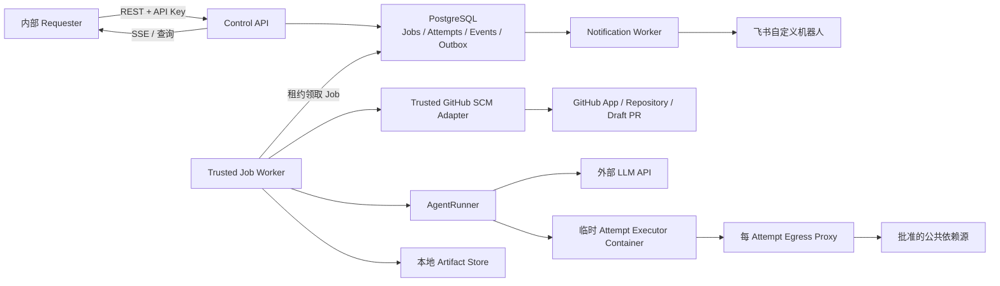

# MewCode Coding Agent 平台 MVP 可执行方案

## 1. 目标与边界

MVP 面向内部单租户调用方，把一个结构化 Work Request 异步执行为一个经过 Verification 的 GitHub Draft Pull Request，并将关键状态通知到飞书。

已确定的边界：

- 单仓库、单基线、单 PR，只处理 Bug 修复和小型修改。
- 仅接受已安装 MewCode GitHub App 的仓库，不接受 PAT、SSH 私钥或源码压缩包。
- 自动分析、修改和验证；所有调用方声明的验证命令成功后才创建 Draft PR。
- 无法安全继续时进入 `NEEDS_INPUT`；不可恢复失败进入 `FAILED`；平台不自动合并 PR。
- 首版只监听本机 `127.0.0.1`，使用 API Key 认证。
- 本地 MVP 的 Platform Capacity 为1、规范化 Repository Size不超过2GiB、每个 Attempt活动处理最长60分钟、Worker Lease过期自动恢复1次；迁移到服务器并完成压测后再把目标提高到5个并发 Attempt。
- 支持普通 Git 仓库，不支持 Git LFS、submodule、跨仓库修改或 `.github/workflows/**` 修改。
- Executor Container 只允许访问批准的公共依赖源；GitHub、LLM 和飞书凭证不进入 Executor。
- Job 元数据和事件保留 30 天，失败日志、diff 和测试报告保留 7 天，临时工作区终态后销毁。

不在 MVP 范围内：多租户 SaaS、计费、自动合并、GitHub Issue 触发、飞书内直接回复、私有依赖网络、多 Agent 团队、长期跨 Job 记忆和生产级 Kubernetes 调度。

## 2. 总体架构



控制面与执行面的关键隔离：

- `api`、`worker`、`notifier` 是受信任组件。
- `AgentRunner` 持有 LLM 访问能力，但不把 LLM API Key传给命令执行环境。
- SCM Adapter 即时申请 GitHub App installation token，并负责 checkout、commit、push 和创建 PR；token 不进入 Agent prompt、工具参数、日志或 Executor。
- Executor Container 只包含 Attempt Workspace、清洗后的环境变量和资源配额，不挂载 Docker socket、宿主目录、`.env` 或长期凭证。
- 仓库文件、构建脚本、测试代码、附件和 Work Request 文本全部按不可信输入处理。

## 3. 本地 Docker Compose 拓扑

在开发电脑上安装并启动 Docker Desktop，启用 WSL2、Linux containers 和 Compose v2。Compose 常驻以下服务：

| 服务 | 职责 | 对外端口 |
| --- | --- | --- |
| `api` | REST、SSE、API Key、输入校验 | `127.0.0.1:8080` |
| `postgres` | Job、Attempt、Event、租约、Outbox | 不暴露宿主端口 |
| `worker` | 领取 Job、驱动 SCM/Agent/Verification | 无 |
| `notifier` | 可靠投递飞书消息 | 无 |

本地 Artifact Store 使用命名卷或 Compose 管理的数据目录，不在 MVP 引入 MinIO。存储接口保持可替换，服务器部署时可以换为 S3 兼容对象存储。

MVP 不引入 Redis。Worker 使用 PostgreSQL 行锁和租约领取队列任务；`FOR UPDATE SKIP LOCKED` 避免多个 Worker 争抢同一 Job。基线并发只有 5，单一持久化系统更容易恢复和排障。

`worker` 为启动临时 Executor Container 需要访问 Docker Engine。开发环境可以让这个受信任服务访问 Docker socket，但这是宿主级高权限，不允许透传给 Executor，也不能作为未来公网生产部署的安全方案。迁移到服务器后应把 Worker 放在专用 Runner 主机；进一步生产化时改为 Kubernetes Job 或受隔离的容器运行服务。

本地默认设置 `MAX_CONCURRENT_JOBS=1`，只启动一个 Worker 消费槽。并发限制必须由数据库租约和 Worker 调度共同保证，不能只依赖 Compose 的副本数。

## 4. Job 与 Attempt 状态模型

Job 表示 Work Request 的持久生命周期，Attempt 表示一次实际执行。重试或补充信息会创建新 Attempt，但不会创建新的 Job 或改变固定的 base SHA。

### Job 状态

```text
RECEIVED -> QUEUED -> RUNNING -> SUCCEEDED
                         |  \
                         |   -> FAILED
                         |   -> NEEDS_INPUT -> QUEUED
                         |   -> CANCEL_REQUESTED -> CANCELLED
                         -> Worker lease expired -> QUEUED 或 FAILED
```

### Attempt 阶段

```text
PREPARING
  -> ANALYZING
  -> IMPLEMENTING
  -> VERIFYING
  -> PUBLISHING
  -> CLEANING_UP
```

约束：

- Job 只有在 Draft PR 已创建并持久化 `pr_url` 后才能进入 `SUCCEEDED`。
- 飞书投递失败不反向改变 Job 的业务终态，由 Outbox 独立重试。
- `NEEDS_INPUT` 不是失败；`POST /input` 写入补充信息并创建新 Attempt。
- Worker 每隔固定时间续租；租约过期后调度器最多自动重试一次。
- 取消操作先写入 `CANCEL_REQUESTED`，再终止 Agent task、命令进程组和 Executor Container，最终进入 `CANCELLED`。

## 5. HTTP API 契约

### 创建 Job

`POST /v1/jobs` 返回 `202 Accepted`。请求必须包含 `Idempotency-Key`；同一 Requester 和同一 key 重试时返回原 Job。

```json
{
  "repository": {
    "installation_id": 123,
    "owner": "company",
    "name": "service",
    "base_ref": "main"
  },
  "work": {
    "kind": "bugfix",
    "title": "修复会话过期后的空指针",
    "description": "...",
    "expected_behavior": "...",
    "reproduction": "...",
    "acceptance_criteria": ["..."]
  },
  "execution": {
    "setup_commands": [
      {"name": "install", "command": "uv sync --frozen", "timeout_seconds": 600}
    ],
    "verification_commands": [
      {"name": "tests", "command": "uv run pytest", "timeout_seconds": 600}
    ]
  },
  "attachment_ids": []
}
```

输入校验：

- `verification_commands` 至少一条；单条和总超时受平台上限约束。
- 禁止 payload 包含 token、私钥和任意 Git remote 凭证。
- `kind` 首版只接受 `bugfix` 和 `small_change`。
- GitHub App installation 必须能够访问目标仓库；`base_ref` 在接收阶段解析为不可变 SHA。
- setup/verification 命令来自已认证 Requester，但仍只在受限 Executor 内执行。

### 其他接口

| 方法 | 路径 | 语义 |
| --- | --- | --- |
| `GET` | `/v1/jobs/{job_id}` | Job、当前 Attempt、阶段、PR和错误摘要 |
| `GET` | `/v1/jobs/{job_id}/events` | 分页读取已持久化事件 |
| `GET` | `/v1/jobs/{job_id}/events/stream` | SSE；支持 `Last-Event-ID` 续读 |
| `POST` | `/v1/jobs/{job_id}/input` | 为 `NEEDS_INPUT` 补充信息并重新排队 |
| `POST` | `/v1/jobs/{job_id}/cancel` | 幂等请求取消 |
| `POST` | `/v1/jobs/{job_id}/retry` | 对 `FAILED` Job 创建新 Attempt |
| `GET` | `/v1/jobs/{job_id}/artifacts` | 列出所属 Requester 可访问的执行证据 |
| `GET` | `/v1/jobs/{job_id}/artifacts/{artifact_id}` | 下载并校验 Artifact |
| `GET` | `/health/live` | 进程存活检查 |
| `GET` | `/health/ready` | 数据库和调度能力检查 |

API Key 只在创建时显示，数据库保存哈希；日志只记录 key id。首版虽然只监听 localhost，仍执行认证，以免日后扩大监听地址时裸奔。
请求附件上传不属于当前 MVP，`POST /v1/attachments` 不注册，所有 `attachment_ids`
必须为空。

## 6. 持久化模型

### `jobs`

- `id`, `tenant_id`, `requester_id`, `idempotency_key`
- `status`, `stage`, `current_attempt_no`
- `installation_id`, `repo_owner`, `repo_name`, `base_ref`, `base_sha`
- Work Request、acceptance criteria 和 Verification Contract 的 JSONB 快照
- `pr_number`, `pr_url`, `head_branch`, `head_sha`
- `error_code`, `error_message`
- `created_at`, `updated_at`, `finished_at`, `retention_until`

唯一约束：`(requester_id, idempotency_key)`。

### `attempts`

- `id`, `job_id`, `attempt_no`, `status`, `stage`
- `worker_id`, `lease_expires_at`, `heartbeat_at`
- `started_at`, `finished_at`, `failure_code`
- LLM token、模型、耗时和成本统计

唯一约束：`(job_id, attempt_no)`。

### `job_events`

- `id`, `job_id`, `attempt_id`, `sequence`, `event_type`
- 已脱敏的 `payload`, `created_at`

唯一约束：`(job_id, sequence)`；SSE 只投影这些持久化事件，不直接广播内存事件。

### `job_inputs`

- `id`, `job_id`, `attempt_id`, `content`, `attachment_ids`, `created_at`

### `artifacts`

- `id`, `job_id`, `attempt_id`, `kind`, `storage_key`
- `sha256`, `size_bytes`, `content_type`, `expires_at`

`kind` 首版只包括 `agent_log`、`command_log`、`diff` 和 `verification_report`。

### `notification_outbox`

- `id`, `job_id`, `source_event_sequence`, `event_type`, `destination`, `payload`
- `status`, `attempt_count`, `next_attempt_at`, `last_error`
- `locked_by`, `fencing_token`, `lease_expires_at`, `delivered_at`, `updated_at`

唯一约束：`(job_id, source_event_sequence, destination)`，保证同一持久化事件只入队
一次，同时允许同一 Job 在不同 Attempt 多次进入同类状态。飞书 webhook交付为
at-least-once；Notification ID 用于识别崩溃歧义窗口产生的重复卡片。

## 7. 单个 Job 的执行流水线

1. **接收**：认证、schema 校验、Idempotency-Key 去重。
2. **仓库验证**：确认 GitHub App installation 对仓库有权；解析并保存 `base_sha`。
3. **准备工作区**：SCM Adapter 从固定 SHA 为新 Attempt 创建干净的 Attempt Workspace；禁用 submodule、LFS 和 Git hooks；清除凭证和 remote URL 中的敏感信息。
4. **启动 Executor**：非 root 用户、只挂载当前 Attempt Workspace、清洗环境变量、限制 CPU/内存/PID/磁盘和总时长；不挂载 Docker socket。
5. **Setup**：逐条运行调用方提供的 setup commands；首个非零退出或超时以 `SETUP_FAILED` 结束。
6. **分析与修改**：AgentRunner 复用现有 Agent 循环，但所有文件访问绑定 Attempt Workspace，所有 Bash 调用委托给 Executor。
7. **Verification**：平台而不是 Agent 逐条执行 Verification Contract；所有 exit code 必须为 0。失败结果最多反馈给 Agent 进行两轮修复，再执行完整 Verification。
8. **可信收口**：导出 Workspace、生成并持久化四类 Artifact，关闭 Runtime，并确认 Executor 容器、网络和 volume 全部清零。
9. **形成 Delivery**：事务推进到不可取消的 `PUBLISHING` 后，受信任 SCM Adapter 生成提交、推送 `mewcode/{job_id}` 分支，并幂等创建 Draft PR。
10. **持久化终态**：写入 PR URL、最终 commit、Verification 报告和 usage，然后置为 `SUCCEEDED`；在同一事务中生成 Phase 6 Notification Outbox记录。

PR 内容固定包含：Work Request 摘要、修改说明、Verification 命令及结果、风险/未覆盖项、Job ID和生成声明。Agent 不得创建正式 PR、合并 PR、force push 或改写目标分支。

## 8. 安全基线

### 凭证

- LLM API Key、GitHub App private key、飞书 webhook 通过 Compose secrets 只挂载到所需的受信任服务。
- GitHub installation token 按 Job 即时生成、最小权限、短期使用，不写数据库和 Artifact。
- 日志、事件和工具结果统一经过 secret redaction。

### 仓库与提示注入

- `AGENTS.md`、`MEWCODE.md` 等只作为仓库指导，不得覆盖平台安全策略、Verification Contract 或工具权限。
- 不加载仓库提供的 `.mewcode/config*.yaml`、permissions、MCP、skills、hooks 或长期 memory。
- 禁止 `@include` 读取 workspace 外路径，禁止 `~`、绝对路径和父目录逃逸。
- Git hooks 统一设置为空目录；不复制 `.env`，不链接宿主 `.venv`、`node_modules` 或 vendor。

### Executor

- 非 root、只读根文件系统、最小可写挂载、drop capabilities、`no-new-privileges`。
- 限制 CPU、内存、PID、文件数、磁盘、命令超时和 Attempt deadline。
- Attempt network 只连接内部网络和 egress proxy；允许域名由平台配置，不由 Work Request 或仓库修改。
- Cancel/timeout 必须杀死进程组并最终销毁容器，不能只取消 Python coroutine。

### 平台自身

- 所有工具调用必须经过统一 policy gate；不能存在并发批次绕过权限和 hooks 的执行路径。
- Bash 返回结构化 `exit_code/stdout/stderr/timed_out`，非零退出码不能被误判为成功。
- Event 带 `job_id/attempt_id/sequence/timestamp`，并在持久化前脱敏。
- API、Worker 和 Notifier 使用不同数据库角色和最小权限。

## 9. 对现有代码的改造边界

保留现有 CLI/TUI；不要把 `RemoteServer` 扩写成平台控制面。新平台使用独立 ASGI 应用，并复用 Agent 内核。

建议新增：

```text
mewcode/platform/
  api/                 # ASGI app、schemas、认证、SSE
  domain/              # Job/Attempt 状态与转换规则
  persistence/         # repositories、事务、迁移
  runtime/             # AgentRuntimeFactory、JobRunner、JobResult
  execution/           # ExecutionEnvironment、DockerExecutor
  scm/                 # GitHub App、checkout、push、Draft PR
  artifacts/           # 本地/S3-compatible ArtifactStore
  notifications/       # Outbox、Feishu adapter
  workers/             # Job worker、notifier、lease/heartbeat
```

优先抽取或修改的现有边界：

- `Agent.run()` 与 `run_to_completion()` 收敛为统一的结构化结果和对称生命周期。
- 新增 `AgentRuntimeFactory`，消除 CLI、TUI 和 Remote 的初始化分叉。
- Bash 工具委托 `ExecutionEnvironment`，支持结构化退出状态、进程组取消和容器执行。
- Context、tool-result spill 和 RecoveryState 全部显式绑定 `job_id/attempt_id`，并存放在不挂载进 Executor 的受信任 Attempt 状态目录。
- 平台模式禁用 Memory、Team、SubAgent、项目 hooks/MCP/skills，后续逐项安全评估后再启用。
- AgentEvent 映射为持久化 JobEvent；现有 UI 仍可继续消费 AgentEvent。
- WorktreeManager 保留给本地 CLI/团队协作；平台的初始 checkout 与最终发布由 SCM Adapter 管理。

## 10. 实施阶段与验收

### Phase 0：测试护栏与威胁模型（2～3 天）

- 固化恶意仓库、提示注入、secret canary、超时进程、磁盘/PID耗尽测试样例。
- 为现有 CLI/TUI关键行为建立回归测试。

验收：明确哪些输入不可信；后续重构能证明没有破坏现有入口。

### Phase 1：统一 Agent Runtime（4～6 天）

- 引入 `AgentRuntimeFactory`、`JobRunner`、`JobResult`、`JobEventSink`。
- 修复权限绕过、非零 exit code、取消和 hook 生命周期不对称问题。

交付状态（2026-08-21）：已完成。CLI `-p`、TUI 和 Remote 已迁移到统一
RuntimeFactory；四个 Phase 1 严格 `xfail` 已升级为普通契约测试。接口和行为说明
见 `docs/platform/phase1-agent-runtime.md`。

验收：CLI/TUI测试通过；同一个内核可在测试中产生结构化成功、失败和取消结果。

### Phase 2：Docker ExecutionEnvironment（5～7 天）

- 实现 Attempt Workspace、短命令容器、资源限制、清洗 env、整容器取消和每 Attempt egress proxy。
- 禁用仓库 hooks/config/MCP/skills/memory及 workspace 外读取。

交付状态（2026-08-21）：已完成。`PLATFORM` profile 现在强制要求
ExecutionEnvironment；每个 Attempt 使用有界 tmpfs workspace、internal network、
非 root Squid 侧车和短命令容器。文件访问、统一脱敏、fatal 终止及按 labels 的
有界清理已有单元与 Docker 恶意夹具覆盖。接口和运行说明见
`docs/platform/phase2-docker-execution-environment.md`，隔离取舍见 ADR 0010。

验收：恶意测试仓库无法读取 LLM/GitHub/飞书 secrets、宿主文件或 Docker socket；取消后没有残留进程和容器。

### Phase 3：Control API 与 PostgreSQL 工作流（5～7 天）

- ASGI API、API Key、Idempotency-Key、Job/Attempt/Event/Artifact/Outbox迁移。
- PostgreSQL 队列、租约、heartbeat、恢复、SSE和 `/input`。

交付状态（2026-08-21）：已完成。独立 FastAPI Control API、Requester API Key、
Alembic/PostgreSQL schema、幂等 Job、Attempt 状态机、持久化 JobEvent/SSE、全局
单并发领取、Worker Lease、fencing、heartbeat、取消和一次自动恢复均已实现。
Repository Target Resolver 与 Attempt Processor 通过 port 注入；未配置时分别拒绝
创建 Job 和启动 Worker，真实 GitHub/Agent 流程仍保留给后续阶段。Artifact/Outbox
本阶段仅提供 schema 与 port。交付和运行说明见
`docs/platform/phase3-control-api-postgres.md`。

验收：API 重复提交只生成一个 Job；API/Worker 重启不丢任务；SSE 可断点续读；租约过期能安全重试。

本地额外验收：同时提交多个 Job 时只能有一个进入 `RUNNING`，其余保持 `QUEUED`。

### Phase 4：GitHub App 与 Draft PR（4～6 天）

- installation 校验、固定 SHA、安全归档、bot commit、创建 ref和幂等 PR创建。
- 禁止 force push、workflow 修改、submodule和LFS。

交付状态（2026-08-22）：已完成。GitHub.com App Resolver、短期且单仓库权限收窄的
installation token、无 `.git` 归档、可信 manifest、Git Data API 发布、确定性分支与
幂等 Draft PR 已实现；完整 Delivery 证据已接入 PostgreSQL 终态。生产 Worker 的发布
链路已在 Phase 5 接通。交付与运行说明见
`docs/platform/phase4-github-app-draft-pr.md`，安全取舍见 ADR 0011。

验收：在专用测试仓库中完成端到端 Draft PR；重复发布不产生第二个分支或 PR；Agent 容器内找不到 GitHub token。

### Phase 5：Verification 与 Artifact（5～7 天）

- 执行调用方 setup/verification commands、生成报告、失败修复循环和保留策略。

交付状态（2026-08-25）：已完成并正式验收。生产 Attempt Processor、最多两轮 Repair Round、
四类受信任 Artifact、fencing metadata、Requester 下载、保留 janitor、发布前清理闸门
和 `PUBLISHING` 取消冲突均已落地。验收实现提交 `9757b70` 的常规跨平台门禁与受保护
Phase 5 live gate均通过；Live Gate 证据为 GitHub Actions run `32843163043`。交付说明见
`docs/platform/phase5-verification-artifacts.md`，证据边界见 ADR 0012。

验收：任意一条 Verification 失败都不创建 PR；成功 PR包含完整且可追踪的 Verification 证据。

### Phase 6：飞书与可观测性（2～3 天）

- Outbox 重试、飞书卡片、结构化日志、健康检查和基础指标。
- 通知 `JOB_ACCEPTED`、`NEEDS_INPUT`、`SUCCEEDED`、`FAILED`、`CANCELLED`。

交付状态（2026-08-26）：已完成并正式验收。五类 Job Event 原子生成 Transactional Outbox，
独立 Notifier使用租约和fencing无限重试飞书；JSON日志、三组Prometheus指标、分类
readiness、最小权限Compose角色和受保护Phase 6 live gate均已落地。交付说明见
`docs/platform/phase6-feishu-observability.md`，at-least-once边界见 ADR 0013。验收实现提交
`ab2d15c` 的真实飞书 Live Gate已通过；GitHub Actions证据为 run `32951183849`。

验收：飞书临时不可用不影响 Job 终态，恢复后不漏发；正常并发不重复，飞书已接收但
Notifier尚未确认时崩溃的重复窗口符合记录的at-least-once语义。

### Phase 7：端到端硬化（4～6 天）

- 本地先完成单并发下的2GiB Repository Size边界、每 Attempt 60分钟 deadline、Worker崩溃、重复 API/通知/PR测试；迁移到服务器后再执行5并发压测。
- 编写本地 Compose 运维手册、备份恢复和故障排查说明。

交付状态（2026-08-26）：实现已完成，正式本地验收待运行。Platform Capacity与
Worker Slot已分离并带活跃 Worker一致性检查；每 Attempt可配置且最大3600秒 deadline、
5分钟 Worker Drain、2GiB规范化 Repository Size、2.25GiB下载防护、排队/容量指标、
停机一致备份/空环境恢复脚本、真实2GiB门禁和 fail-closed验收证据验证器均已落地。
运行与验收说明见 `docs/platform/phase7-end-to-end-hardening.md`，本地运维见
`docs/platform/phase7-local-operations.md`，容量取舍见 ADR 0014。正式20-Job混合负载、
真实3600秒和备份恢复演练尚未执行；服务器5并发明确保持 `PENDING`。

验收：达到已约定的 MVP 容量基线，并通过安全测试清单。

单人实施的现实周期约为 4～6 周；两人可将 API/持久化与执行隔离/GitHub 接入并行，压缩到约 3～4 周。安全隔离和 GitHub 幂等交付不能为了赶进度跳过。

## 11. 开工前准备

1. 修复并启动 Docker Desktop，确认 `docker version` 能看到 Server，`docker compose version` 可用。
2. 准备一个专用 GitHub Organization 或测试仓库，创建 GitHub App。
3. GitHub App MVP 权限：Metadata read、Contents read/write、Pull requests read/write；不授予 Workflows。
4. 准备外部 LLM API Key，并确认内部代码允许发送给该供应商。
5. 创建飞书群自定义机器人，保存 webhook/签名 secret。
6. 选一个不使用 LFS/submodule、能用一组确定命令安装和测试的试点仓库。
7. 确认开发电脑有足够的 Docker 内存；Attempt Workspace 使用有硬上限的 Linux tmpfs named volume，不使用 Windows bind mount。

## 12. Go/No-Go 标准

只有同时满足以下条件，MVP 才算可以迁移到双 4090 服务器持续运行：

- 连续 20 个试点 Job 无任务丢失、重复 PR或凭证泄漏。
- Worker/API重启测试通过，失败 Job 可以获取 diff、日志和Verification报告。
- 本地单并发下资源限制和每 Attempt 60分钟 deadline生效且无残留容器；迁移服务器前补充通过5并发压测。
- 所有 PR均来自固定 SHA，且所有声明的 Verification 命令成功。
- 飞书故障可重试，通知不影响 Job 终态。
- 恶意仓库样例不能访问宿主、Docker socket、GitHub token、LLM key或飞书 webhook。

## 13. 设计依据

- [Docker Compose services 与 secrets](https://docs.docker.com/reference/compose-file/services/)
- [Docker Engine 安全与 daemon attack surface](https://docs.docker.com/engine/security/)
- [PostgreSQL `SELECT ... SKIP LOCKED`](https://www.postgresql.org/docs/current/sql-select.html)
- [GitHub App 权限选择](https://docs.github.com/en/apps/creating-github-apps/registering-a-github-app/choosing-permissions-for-a-github-app)
- [GitHub REST API 创建 Pull Request](https://docs.github.com/en/rest/pulls/pulls)
